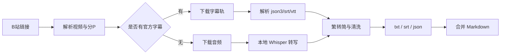

# bili-transcript-studio — B站视频转录本地工作台


> 一键将 B 站视频、合集和分 P 转为高质量逐字稿。  
> 字幕优先，本地模型兜底，自动输出简体中文。

---

## 功能特性

- **B站视频解析** — 输入视频链接，自动获取标题、分 P、CID 等信息。
- **字幕优先提取** — 优先下载官方字幕轨，支持 `json3`、`srt`、`vtt`。
- **本地语音转写** — 无可用字幕时自动下载音频，并使用本地 Whisper 模型转写。
- **Apple Silicon 加速** — macOS 上优先使用 `mlx-whisper` + `large-v3-turbo`。
- **跨环境兜底** — 支持 `faster-whisper`，本机 `whisper` CLI 可作为最后兜底。
- **自动简体化** — 输出文本、字幕、JSON 和合并稿统一转为简体中文。
- **多格式输出** — 同时生成 `.txt`、`.srt`、`.json` 和 `all_transcripts.md`。
- **本地桌面 GUI** — macOS 可打包为独立 `.app`，双击启动。
- **Web UI + API** — 内置 FastAPI 服务和浏览器前端，适合二次开发。

---

## 在线/本地演示

桌面应用支持：

- 输入 B 站视频链接
- 选择本地模型
- 设置分 P 上限
- 实时查看任务进度
- 一键打开任务目录、逐字稿目录和合并稿

Web UI 启动后访问：

```text
http://127.0.0.1:8787
```

---

## 技术路线



核心组件：

- `FastAPI`：本地 API 与 Web UI 服务
- `yt-dlp`：B 站解析、字幕下载、音频提取
- `mlx-whisper`：Apple Silicon 本地转写加速
- `faster-whisper`：通用本地 Whisper 推理
- `Tkinter`：macOS 独立桌面 GUI
- `ffmpeg`：音频处理

---

## 安装

```bash
python3 -m venv .venv
.venv/bin/python -m pip install -U pip
.venv/bin/python -m pip install -r requirements.txt
```

国内网络或已开启本机代理时，可以使用镜像：

```bash
mkdir -p .cache/pip
PIP_CACHE_DIR=.cache/pip .venv/bin/python -m pip install -r requirements.txt \
  -i https://pypi.tuna.tsinghua.edu.cn/simple \
  --trusted-host pypi.tuna.tsinghua.edu.cn \
  --retries 10 --timeout 60
```

如需设置代理、模型缓存等参数：

```bash
cp .env.example .env
```

然后按需修改 `.env`。

---

## 启动 Web UI

```bash
bash scripts/run_app.sh
```

或手动启动：

```bash
.venv/bin/python -m uvicorn app.main:app --host 127.0.0.1 --port 8787
```

浏览器打开：

```text
http://127.0.0.1:8787
```

---

## 启动桌面 GUI

开发模式：

```bash
.venv/bin/python -m app.gui
```

构建 macOS 应用：

```bash
python3 scripts/build_mac_app.py
```

生成的应用位于：

```text
dist/B站逐字稿.app
```

说明：`.app`、模型依赖、任务数据和生成稿不会提交到 Git，需在本机自行构建。

---

## 命令行使用

```bash
.venv/bin/python -m app.cli "https://www.bilibili.com/video/BVxxxxxx" \
  --model large-v3-turbo \
  --max-parts 1
```

参数说明：

- `--model`：转写模型，默认 `large-v3-turbo`
- `--max-parts`：限制处理的分 P 数量，留空表示全部
- `--language`：默认 `zh`

---

## 输出结果

每个任务会写入：

```text
data/jobs/<job_id>/
```

常用文件：

- `all_transcripts.md`：所有分 P 合并稿
- `transcripts/*.txt`：纯文本逐字稿
- `transcripts/*.srt`：带时间戳字幕
- `transcripts/*.json`：结构化分段结果，包含 `source`
- `subtitles/`：可提取到的官方字幕或弹幕文件
- `audio/`：无字幕时下载的音频

`source` 字段说明：

- `subtitle`：来自 B 站官方字幕轨
- `asr`：来自本地语音模型转写

---

## 字幕策略

工具会优先提取 B 站官方字幕。只有满足以下条件时才能直接提取：

- B 站播放器 API 返回字幕轨
- 字幕存在 `subtitle_url`
- 字幕格式可解析为 `json3`、`srt` 或 `vtt`

如果视频只有弹幕、硬字幕、浏览器自动字幕，工具无法直接提取，会自动回退到本地 ASR。

---

## 项目结构

```text
app/
  gui.py          # 桌面 GUI
  main.py         # FastAPI 服务
  jobs.py         # 任务队列与进度
  pipeline.py     # 字幕提取、音频下载、ASR、输出
  simplify.py     # 简体化后处理
static/           # Web 前端
scripts/          # 启动、打包、文档处理脚本
```

---

## 许可

本项目基于 [MIT License](LICENSE) 开源。
